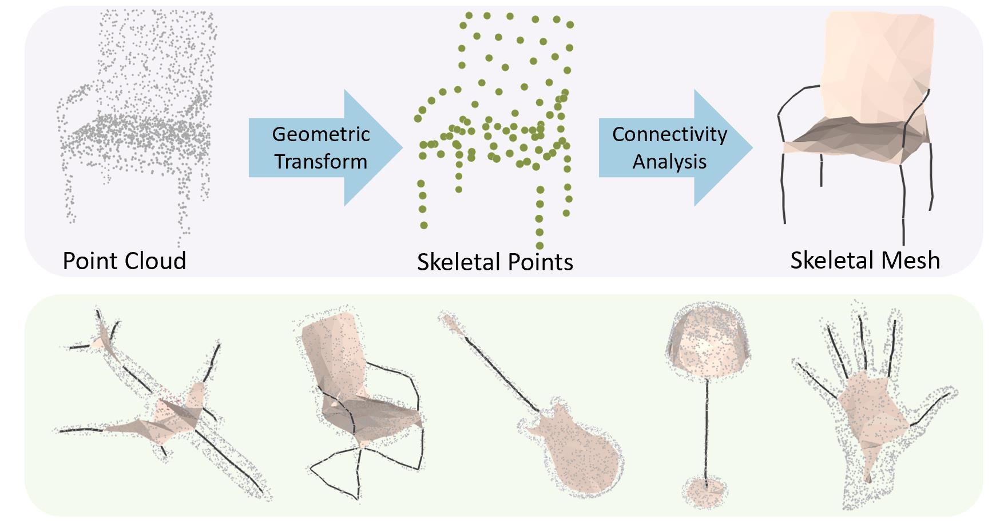
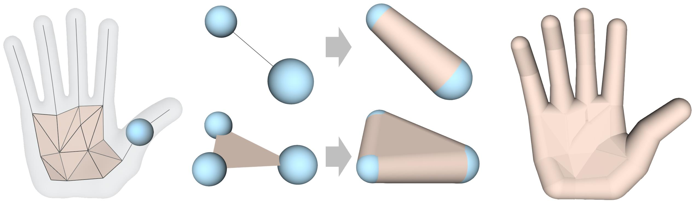

# Point2Skeleton

This repository contains the source code for the CVPR 2021 oral paper [Point2Skeleton: Learning Skeletal Representations from Point Clouds](https://arxiv.org/abs/2012.00230), where we introduce an unsupervised method to generate skeletal meshes from point clouds. 

<a>
    
</a>


## Skeletal Mesh

                    
We introduce a generalized skeletal representation, called skeletal mesh. Several good properties of the skeletal mesh make it a useful representation for shape analysis:

- **Recoverability** The skeletal mesh can be considered as a complete shape descriptor, which means it can reconstruct the shape of the original domain. 

- **Abstraction** The skeletal mesh captures the fundamental geometry of a 3D shape and extracts its global topology; the tubular parts are abstracted by simple 1D curve segments and the planar or bulky parts by 2D surface triangles. 

- **Structure awareness** The 1D curve segments and 2D surface sheets as well as the non-manifold branches on the skeletal mesh give a structural differentiation of a shape.

- **Volume-based closure** The interpolation of the skeletal spheres gives solid cone-like or slab-like primitives; then a local geometry is represented by volumetric parts, which provides better integrity of shape context. The interpolation also forms a closed watertight surface.

<a>
    
</a>


## Code
### Installation
You need to install [PyTorch](https://pytorch.org/), [NumPy](https://numpy.org/), and [TensorboardX](https://github.com/lanpa/tensorboardX) (for visualization of training). This code is tested under Python 3.7.3, PyTorch 1.1.0, NumPy 1.16.4 on Ubuntu 18.04.

To setup PointNet++, please use:
```
pip install -r requirements.txt
cd src/pointnet2
python setup.py build_ext --inplace
```

### Training
* Example command with required parameters:
```
cd src
python train.py --pc_list_file ../data/data-split/all-train.txt --data_root ../data/pointclouds/ --point_num 2000 --skelpoint_num 100 --gpu 0
``` 
* Can simply call `python train.py` once the data folder `data/` is prepared.
* See `python train.py --help` for all the training options. Can change the setting by modifying the parameters in `src/config.py`

### Testing
* Example command with required parameters:
```
cd src
python test.py --pc_list_file ../data/data-split/all-test.txt --data_root ../data/pointclouds/ --point_num 2000 --skelpoint_num 100 --gpu 0 --load_skelnet_path ../weights/weights-skelpoint.pth --load_gae_path ../weights/weights-gae.pth --save_result_path ../results/
``` 
* Can also simply call `python test.py` once the data folder `data/` and network weight folder `weights/` are prepared.
* See `python test.py --help` for all the testing options. 

### Download 
* Train/test data [data.zip](https://drive.google.com/file/d/1sNU1av82qrEMq0mTQVl-e_4eo0mkKXsZ/view?usp=sharing).
* Pre-trained model [weights.zip](https://drive.google.com/file/d/1pPboSALmvZJTEjFLgmKBXm32RNVVR1zt/view?usp=sharing).
* Unzip the downloaded files to replace the `data/` and `weights/` folders; then you can run the code by simply calling `python train.py` and `python test.py`.
* Dense point cloud [data_dense.zip](https://drive.google.com/file/d/1VBrkf1Gx9kVlyVuSHV5srXGLmqaT5-8Y/view?usp=sharing) and simplified MAT [MAT.zip](https://drive.google.com/file/d/1To8_ot9yxmY5AMjHKc9bqG03I84ydwXy/view?usp=sharing) for evaluation.

## Acknowledgement
We would like to acknowledge the following projects:

[Unsupervised Learning of Intrinsic Structural Representation Points](https://github.com/NolenChen/3DStructurePoints)

[Pointnet++ PyTorch](https://github.com/erikwijmans/Pointnet2_PyTorch)

[Graph Convolution](https://github.com/linhaojia13/GCN_pointcloud)

## Citation
If you find our work useful in your research, please consider citing:

```
@InProceedings{Lin_2021_CVPR,
    author    = {Lin, Cheng and Li, Changjian and Liu, Yuan and Chen, Nenglun and Choi, Yi-King and Wang, Wenping},
    title     = {Point2Skeleton: Learning Skeletal Representations from Point Clouds},
    booktitle = {Proceedings of the IEEE/CVF Conference on Computer Vision and Pattern Recognition (CVPR)},
    month     = {June},
    year      = {2021},
    pages     = {4277-4286}
}
```

## Contact
If you have any questions, please email [Cheng Lin](https://clinplayer.github.io/) at chlin@connect.hku.hk.
