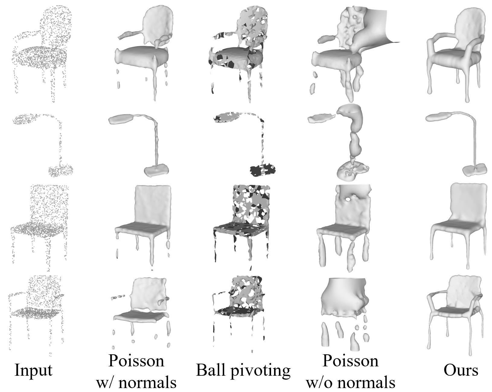
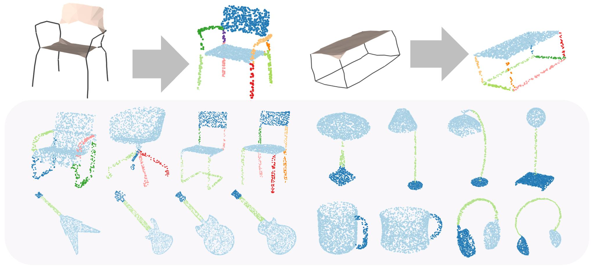

# Point2Skeleton: Learning Skeletal Representations from Point Clouds

We introduce Point2Skeleton, an unsupervised method to learn skeletal representations from point clouds. 

The full code is coming soon!

## Skeletal Mesh

- Recoverability The skeletal mesh can be considered as a complete shape descriptor, which means it can reconstruct the shape of the original domain. 

- Abstraction The skeletal mesh captures the fundamental geometry of a 3D shape and extracts its global topology; the tubular parts are abstracted by simple 1D curve segments and the planar or bulky parts by 2D surface triangles. 

- Structure awareness The 1D curve segments and 2D surface sheets as well as the non-manifold branches on the skeletal mesh give a structural differentiation of a shape.

- Volume-based closure The interpolation of the skeletal spheres gives solid cone-like or slab-like primitives; then a local geometry is represented by volumetric parts, which provides better integrity of shape context. The interpolation also forms a closed watertight surface.

## Unsupervised Reconstruction

## Unsupervised Structural Decomposition

## Contact
If you have any questions, please email [Cheng Lin](https://clinplayer.github.io/) at chlin@hku.hk.
